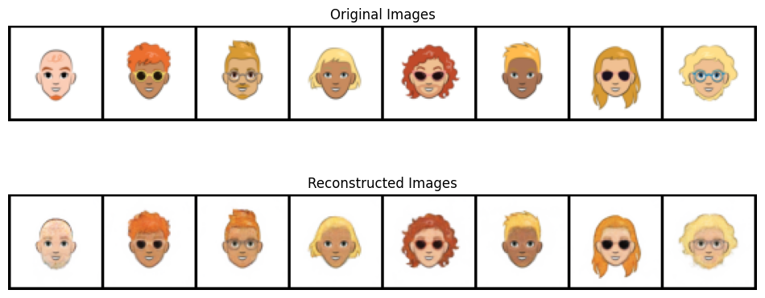
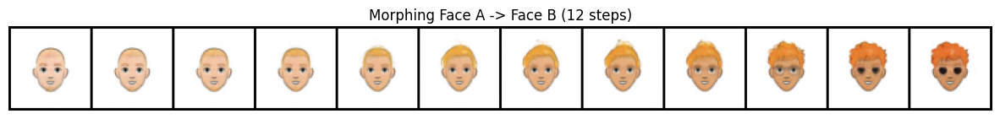
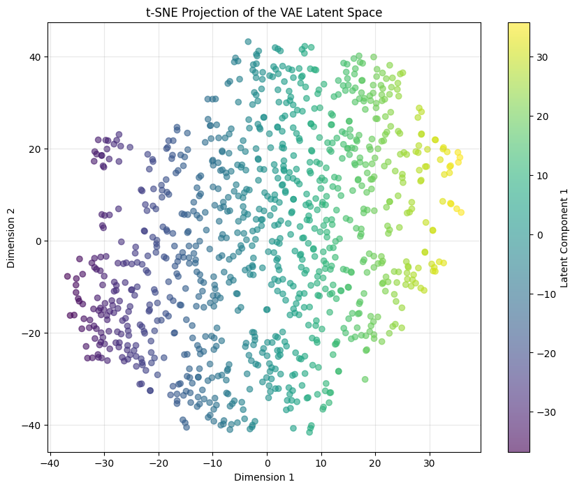

# 🎨 Generative AI: Cartoon Face Synthesis with VAEs


## 📋 Project Overview

This project implements a **Variational Autoencoder (VAE)** from scratch using PyTorch to learn the latent representations of 2D cartoon avatars. Unlike standard Autoencoders, this VAE learns a continuous probability distribution, enabling **generative sampling**, **smooth face morphing**, and **semantic feature arithmetic**.

The model was trained on the **Google Cartoon Set** (100k images) and achieves high-fidelity reconstruction with a structural similarity index (SSIM) of **0.96**.

## ✨ Key Features

* **Custom VAE Architecture:** Deep Convolutional Encoder/Decoder with Reparameterization Trick.
* **Generative Sampling:** Ability to create entirely new, non-existent faces from noise.
* **Latent Space Interpolation:** Smoothly morphing between two distinct faces to prove manifold continuity.
* **Vector Arithmetic:** Manipulating facial features mathematically (e.g., *Face A + (Face B - Face C)*).
* **Dimensionality Reduction:** Compressing 64x64x3 images into a dense 32-dimensional latent vector.
* **Visualization:** t-SNE projections of the latent space and SSIM quality metrics.

## 🛠️ Tech Stack

* **Core Framework:** PyTorch, TorchVision
* **Data Processing:** NumPy, Pandas
* **Visualization:** Matplotlib, Scikit-Learn (t-SNE)
* **Metrics:** TorchMetrics (SSIM)

## 🧠 Model Architecture

The VAE consists of two main networks:

1.  **Encoder:** Compresses the input image ($64 \times 64 \times 3$) through 4 convolutional layers into a probabilistic latent space ($\mu$ and $\sigma$).
2.  **Decoder:** Samples from the latent space ($z \in \mathbb{R}^{32}$) and reconstructs the image using 4 transposed convolutional layers.

**Loss Function:**
$$\mathcal{L} = \mathcal{L}_{Reconstruction} + \beta \cdot \mathcal{L}_{KL}$$
* *Reconstruction Loss:* Mean Squared Error (MSE) ensuring pixel-wise similarity.
* *KL Divergence:* Regularizes the latent space to approximate a standard Normal distribution $\mathcal{N}(0, 1)$.

## 📊 Results

### 1. Reconstruction & Generation
The model successfully reconstructs input images and generates diverse new samples.




### 2. Latent Space Interpolation
By walking linearly between two latent vectors, we can observe smooth semantic transitions (e.g., hair growing, skin tone shifting) rather than simple cross-fading.




### 3. Latent Manifold Visualization (t-SNE)
Projecting the 32-dimensional latent space into 2D shows structured clustering of similar facial features.




## 🚀 How to Run

1.  **Clone the repository**
    ```bash
    git clone [https://github.com/yourusername/cartoon-vae.git](https://github.com/yourusername/cartoon-vae.git)
    cd cartoon-vae
    ```

2.  **Install dependencies**
    ```bash
    pip install torch torchvision matplotlib scikit-learn torchmetrics
    ```

3.  **Dataset**
    This project uses the Google Cartoon Set.
    * Download it from [Kaggle](https://www.kaggle.com/datasets/brendanartley/cartoon-faces-googles-cartoon-set) or the original source.
    * Update the `DATA_PATH` variable in the notebook to point to your local directory.

4.  **Run the Notebook**
    Open `VAE_Cartoon_Faces.ipynb` in Jupyter Lab, VS Code, or Google Colab and execute the cells.

## 📈 Performance Metrics

| Metric | Value |
| :--- | :--- |
| **Final Training Loss** | ~32.0 |
| **SSIM (Validation)** | **0.9602** |
| **Latent Dimension** | 32 |
| **Training Epochs** | 20 |

## 🔮 Future Improvements

* Implement **Beta-VAE** to better disentangle specific features (e.g., separating hair color from gender).
* Scale up to **128x128** resolution using Residual Blocks.
* Build a **Streamlit Web App** to allow users to generate faces via sliders.

## 🤝 Contributing

Contributions, issues, and feature requests are welcome!

## 📜 License

Distributed under the MIT License. See `LICENSE` for more information.
